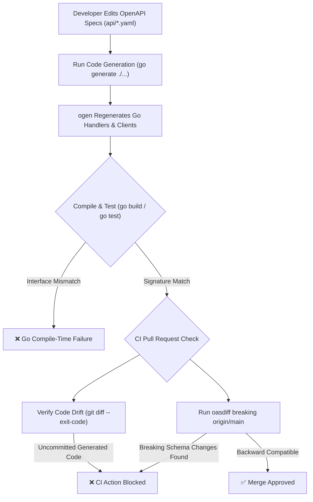

# CPUs-R-Us e-Commerce Backend PoC

A PoC backend implementing a Product Catalog API and a Shopping Cart API for CPUs-R-Us.

---

## 🚀 How to Run

1. **Start the Product API** (Port 8081):
   ```bash
   PORT=8081 go run ./cmd/product-api/main.go
   ```

2. **Start the Cart API** (Port 8082):
   ```bash
   PORT=8082 PRODUCT_API_URL=http://localhost:8081 go run ./cmd/cart-api/main.go
   ```

---

## 🧪 Quick Test

```bash
# 1. Fetch products
curl -s http://localhost:8081/products

# 2. Add 2 floppy disks to cart (requires X-User-Id header)
curl -s -X POST -H "X-User-Id: user-1" -H "Content-Type: application/json" \
  -d '{"product_id":"floppy-disk","quantity":2}' \
  http://localhost:8082/cart/items

# 3. View the cart (resolves product details and total price)
curl -s -H "X-User-Id: user-1" http://localhost:8082/cart
```

---

## 📐 Design Decisions

* **Microservices**: Split into two services (`Product API` & `Cart API`) simulating production microservice boundaries.
* **OpenAPI Generator (`ogen`)**: Used Go code-generation from `/api/*.yaml` contracts to enforce type safety.
* **Client-Side Resolution**: The Cart API acts as an aggregator. It consumes the Product API at runtime via a generated Go HTTP client to resolve product metadata and calculate prices.
* **CORS Middleware**: Implemented standard CORS headers on the Cart API to allow direct integration with frontend websites.
* **In-Memory Store**: Cart items are stored in a thread-safe Go map for simplicity in this PoC.

---

## 🛠️ Tech Stack Rationale

When selecting the language and runtime for this PoC microservice backend, several alternatives were evaluated:

* **Java**: Although the most familiar language after years of experience, the JVM's heavy runtime footprint and warm-up overhead feel less optimal for modern, lightweight microservices.
* **TypeScript**: A strong contender with type safety and zero JVM warm-up time, but the rapidly moving ecosystem often requires more maintenance overhead than justified for a focused task of this scope.
* **Python (FastAPI)**: Another compelling option due to smooth typing support and fast development velocity, but package manager friction ultimately tipped the scales away.

### Why Go Won 🏆
Go compiles into a **single static binary executable** packaging all dependencies. This makes container deployment into minimal base images effortless without interpreters or heavy runtimes slowing down startup. Although the syntax can occasionally feel verbose, the advantages of high performance, sub-millisecond startup times, and a straightforward distribution model made Go the ideal choice.

---

## 🧪 Running Tests

You can run both unit tests and end-to-end integration tests using standard Go tools:
```bash
go test -v ./...
```

---

## 💭 Reflections

### 1. What was challenging about the assignment?
* **Code-Gen Namespacing**: Running the `ogen` OpenAPI generator for two separate APIs within a single Go module generates packages with overlapping names (`api` package inside each target directory). We solved this cleanly by aliasing imports in our code (e.g., `cartapi "github.com/omegagussan/cpus-r-us/pkg/cartapi"`).
* **Decoupling for Testability**: Moving handlers out of `main.go` entrypoints and into the modular generated packages was required to test the logic cleanly using Go's `httptest` package without compiling binaries or starting external network loops.
* **Preventing Breaking API Changes**: Guaranteeing that contract modifications in `/api/*.yaml` do not break backend handlers or clients requires a multi-layered verification pipeline combining Go compile-time checks, OpenAPI linting, and automated diffing in CI:



### 2. What was interesting about the assignment?
* **In-Memory E2E Testing**: Running real HTTP servers on arbitrary ports using `httptest.NewServer` for *both* services allowed us to test preflights, serialization, and service-to-service calls end-to-end in just 6 milliseconds.
* **Type-Safe Client Testing**: Testing the servers via their own generated clients instead of using low-level raw HTTP request payloads made the test assertions type-safe, simple, and self-documenting.
* **AI Tooling Beyond Copilot & Claude**: Setting up agentic AI coding tools outside of traditional in-editor Copilot or company wide Claude Code setup was a great new experience. AI developer tooling is becoming a true commodity, proving that you can get very far with high-level architecture, scaffolding, and testing using basic token usage.

### 3. What could be improved or extended?
* **Database Persistence**: Replace the in-memory maps with a persistent store like Redis, PostgreSQL or honestly just some KV-store. As we don't really need to search, retrievals will be easily handled by ID anyhow and we can scale out application with hosted solution on some of the cloud vendors. Usually comes with IAM permissions out of the box which will play nicely with us hosting the application within the same cloud ecosystem. 
* **Authentication**: Enforce security tokens (e.g., JWT) rather than allowing plain `X-User-Id` request headers.
* **Resilience**: Wrap Product API client requests inside a circuit breaker or retry mechanism to handle transient network issues gracefully.
* **Dockerize Microservices**: Containerize the microservices for deployment. Since Go compiles into standalone binaries, a common base image (or multi-stage Docker build pattern) can be shared across all microservices.
* **Shared OpenAPI Specifications**: Keep common schemas (such as the `Product` definition) in a single shared yaml file and reference it to prevent duplication between `product.yaml` and `cart.yaml`.
* **Repository Architecture & Rolling Deployments**: `Cart API` depends on `Product API`. While this project is currently built as a monorepo in GitHub for convenience, maintaining one deployable entity per repository is generally preferred in production. Monorepo setups make it easy to bundle breaking changes together without enforcing strict API backward compatibility. During rolling deployments, if an older pod of `Product API` is still active while a newer version of `Cart API` attempts to consume it, runtime incompatibility issues can easily arise.
* **Concurrent Reads/Writes & Race Safety**: Built-in concurrency testing (`TestCartHandler_ConcurrentReadsWrites`) verifies parallel read/write handling under `go test -race`. To ensure thread safety when reading in-memory maps, cart items are snapshotted under a `sync.RWMutex` read lock before executing remote network calls to prevent concurrent map iteration/mutation races.
* **Product Deletion & Referential Integrity**: The `Product API` currently lacks a product deletion endpoint. If product deletion were introduced, active or historical carts referencing a removed `product_id` would encounter broken references (resulting in unresolved product metadata, `$0.00` subtotals, or failed checkout validation). Production systems should address this by storing price/metadata snapshots when items are added to a cart and supporting soft deletes (`is_archived` / tombstones) rather than hard deletions.

---

## 🤖 Instructions for Future AI Tools

When modifying or extending this codebase, future AI developers must adhere to the following conventions:

1. **AI Tooling & Setup**: This project was built and maintained using **Google Antigravity (`agy`)**, an agentic AI coding assistant environment, operating on a Go multi-microservice project setup.
2. **Tooling & Tech Stack**:
   - **Language / Runtime**: Go (`1.26+`)
   - **OpenAPI Code Generation**: `ogen` (`github.com/ogen-go/ogen`), generating type-safe HTTP server handlers, request/response decoders, and clients from OpenAPI v3 YAML contracts.
   - **Telemetry**: OpenTelemetry (`go.opentelemetry.io/otel`) integrated via `ogen`.
   - **Testing Framework**: Go standard library `testing` and `net/http/httptest` for modular unit tests and fast in-memory E2E integration tests.
3. **API Specifications**: All endpoint and schema additions must first be declared in [api/product.yaml](file:///home/gussan/GolandProjects/CPUs-R-Us/api/product.yaml) or [api/cart.yaml](file:///home/gussan/GolandProjects/CPUs-R-Us/api/cart.yaml).
4. **Code Generation**: After updating any specification files, regenerate the client/server code using:
   ```bash
   go generate ./...
   ```
5. **Modular Handlers**: Keep the server entrypoints (`cmd/**/main.go`) lean. Implement all business logic inside:
   - [pkg/productapi/handler.go](file:///home/gussan/GolandProjects/CPUs-R-Us/pkg/productapi/handler.go)
   - [pkg/cartapi/handler.go](file:///home/gussan/GolandProjects/CPUs-R-Us/pkg/cartapi/handler.go)
6. **Integration/Unit Tests**: Write unit tests alongside handler code using the `_test.go` suffix. Integration/E2E test flows should be placed inside the [tests/](file:///home/gussan/GolandProjects/CPUs-R-Us/tests) package. All tests must be runnable via `go test -v ./...`.
